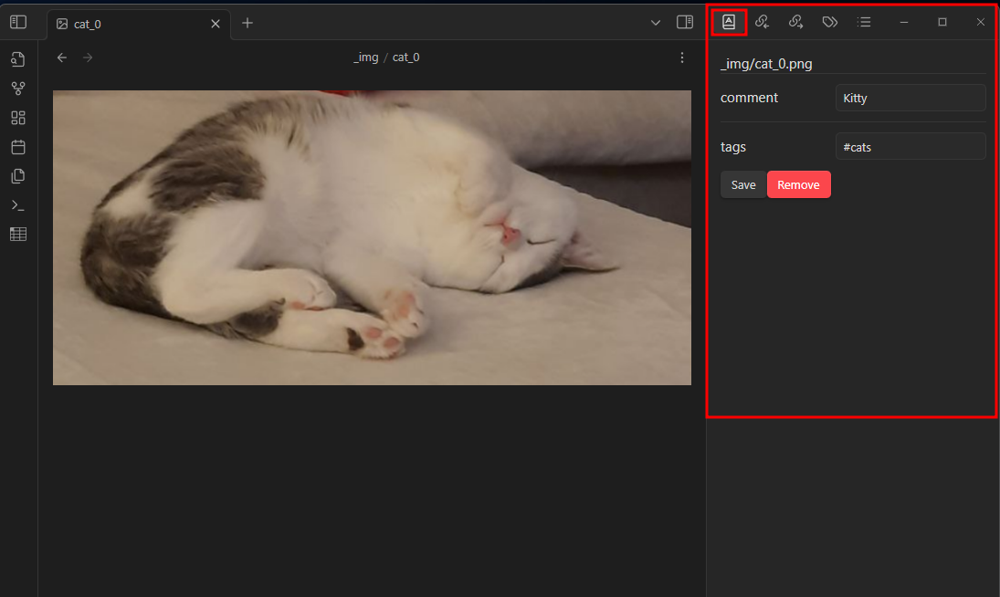

# Obsidian Enhanced Resources

Integration of improved work with images, videos, documents and other resources into Obsidian.

## Features
*Pre-alpha version!*

- Resource files info view
- Add, modify and remove basic info: `comment, tags`
- Add, modify and remove custom info (In Progress)
- Gallery of resources with info (ToDo)
- Group resources by info/tags (ToDo)
- Search resources by info/tags (ToDo)
- Statictics of resources and their info (ToDo)
- Relative info-files (ToDo)

## Example
The plugin adds a right panel with which you can work with information about the file itself. Similar to working with file *metadata*.

For example, this is what it might look like when opening an image.

